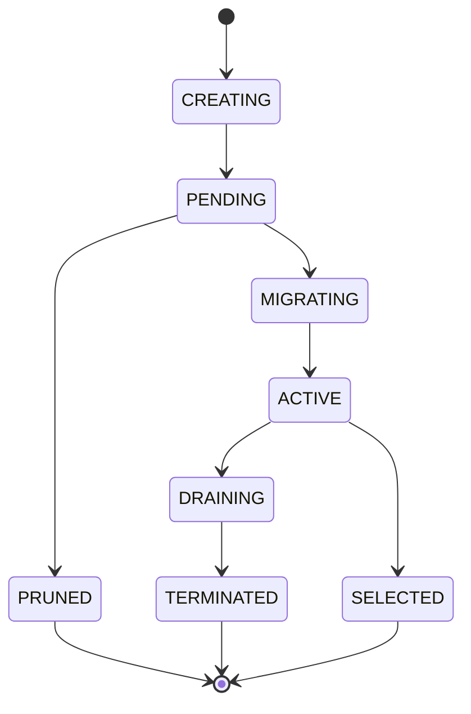

# MendelBuild Design Document

> **Status**: Draft - v0.1
> **Last Updated**: 2025-06-08

---

## 1. Overview & Goals

MendelBuild is an experimental way of delivering software that's designed to take full advantage of modern AI/agentic coding while aligning to product and technology goals and staying within long-term budget envelopes. The thesis is that software innovation can happen much more quickly if we embrace a more evolutionary model of innovation (of product, design, and engineering) where many software variations coexist until natural selection decides which is fittest. Rather than carefully planning a single implementation path, MendelBuild enables teams to:

1. **Generate** multiple potential variations automatically
2. **Evaluate** their fitness through measurable criteria
3. **Select** survivors that become ancestors for future iterations

The system shifts bottlenecks from coding speed to decision-making quality, concentrating human involvement on defining objectives and fitness criteria rather than pushing specific implementations forward (as in a more traditional model).

### 1.1 Design Principles

- **Always know the strategy**: Strategy is a first-class citizen and provides the context that agents need to take informed action
- **Always know the budget**: Tokens, infrastructure costs, error budgets, time, and even fractional user traffic are all accounted for and allocated according to ROI
- **Empirical over predictive**: Prefer experimental evidence to forecasting
- **Decisions as first-class citizens**: Every choice is recorded, scored, and auditable; and humans can decide where the line is for human review vs human decision.

### 1.2 Non-Goals (for v1)

- Full autonomy without human oversight
- Support for non-code artifacts (marketing, legal, etc.) — code-first
- Multi-tenant SaaS deployment — single-project focus initially

---

## 2. Key Concepts

This section defines the core primitives and explains how they compose into a coherent system.

### 2.1 The Evolutionary Hierarchy

```
Project
  └── Strategy
        ├── Objectives (1..n) → Key Results (1..n)
        ├── Funding Sources
        └── Hops (DAG)
              └── Variation (1..n)
```

**Project**: The top-level container. A Project has a Strategy, one or more Repositories, and connections to Ecosystems where code runs.

**Strategy**: The organizational unit for a body of work. Contains:
- **Objectives**: The "O" in OKR — plain-English goals
- **Key Results**: Quantitative targets attached to Objectives, expressed with parseable units (e.g., "1000 users", "99.9%", "< 200ms p99")
- **Funding Sources**: Resource pools (dollars, claude_tokens) linked to Key Results via success criteria
- **Hops**: A DAG of evolutionary experiments (sequenced by dependencies, not wall-clock time)

Strategies can nest (sub-strategies) for organizational alignment.

### 2.2 Hops and Variations

**Hop**: The fundamental unit of evolutionary experimentation. A Hop defines:
- **Commentary**: Context (in English) about the Hop; particularly if it might help with qualitative pruning or scoring (see below)
- **Pruner**: A function that rejects unfit Variations (binary pass/fail)
- **Scorer**: A function that ranks surviving Variations (continuous fitness score)
- **Budget**: Resource limits (tokens, dollars, error budget, etc.)

A Hop does *not* specify *how* to achieve the goal — that's what Variations are for.

**Variation**: A concrete implementation attempt within a Hop. Each Variation has:
- A location in a Repository (specific SHA / commit)
- An optional "deployment" in an Ecosystem (canonical example would be "a pod in prod k8s")
- A lifecycle progression (see longer lifecycle section below)
- Evaluation results against Hop Scorer/Pruner

Each Hop can have many Variations; Variations are filtered using Hop Pruners, assessed via Hop Scorers, and at most one is "selected" and merged back to `main`. Note that Variations (and Hops) can be long-lived.

### 2.3 Decisions and the Decision Queue

**Decision**: A choice point in the system. Every Decision has:
- **Kind**: Pass/Fail, Choose One, Choose Many
- **Details**: Based on the type and 'Kind' of decision, a human- and agent-readable summary of the option or options for the Decision (perhaps with hyperlinks out of the MendelBuild system for more detail)
- **Objectivity score**: How objectively measurable is this decision? (0.0–1.0)
- **Importance score**: How much does this affect strategic goals? (0.0–1.0)
- **Audit log**: Who/what decided, when, with what rationale


**Decision Queue**: An abstraction representing all pending (and historical) decisions. This is *not* exclusively a queue for human decisions — it's a unified interface where decisions are resolved by the appropriate actor. The more important and subjective (i.e., non-objective) decisions are more likely to require human involvement, but the thresholds can be configured.

Eventually, humans with expertise in a particular product or tech area should be the ones to handle decisiosn in those areas, much like code review assignment works/worked in the past, before agentic coding went mainstream.

### 2.4 Repositories and Ecosystems

**Repository**: A versioned store of artifacts (code, design files, etc.). Each Repository has:
- A type (code, design, documentation, etc.)
- An interface for branch creation, commits, and abandonment
- A concept of `main` — the current blessed state

**Ecosystem**: A runtime environment where Variations can be deployed and evaluated. Examples:
- A Kubernetes cluster
- A Vercel/Netlify deployment
- A Squarespace site
- An AdWords campaign

Ecosystems have HealthFuncs that provide baseline availability and quality signals.

### 2.5 Budgets and Funding

**FundingSource**: A pool of resources (dollars, tokens, cloud credits) with a strategic allocation.

**BudgetAllocation**: A slice of funding assigned to a specific Hop. Tracks:
- Limit (hard ceiling)
- Spending (actual, broken down by line item)
- Forecast (predicted spend)

Budget enforcement is soft by default: every time control returns to MendelBuild, budgets are checked. Exceeding a budget triggers a Decision (pause, kill, or continue with human approval).

### 2.6 How It All Fits Together

```
┌─────────────────────────────────────────────────────────────────────┐
│                            PROJECT                                  │
│  ┌───────────────────────────────────────────────────────────────┐  │
│  │ STRATEGY                                                      │  │
│  │   Objectives → Key Results ← Funding Sources                  │  │
│  │   ┌────────────────────────────────────────────────────────┐  │  │
│  │   │ HOPS (DAG)                                             │  │  │
│  │   │   ┌───────────┐   ┌──────────┐   ┌──────────┐          │  │  │
│  │   │   │    Hop    │──▶│    Hop   │──▶│    Hop   │ ──▶ ...  │  │  │
│  │   │   │  ┌─────┐  │   │ ┌─────┐  │   │ ┌─────┐  │          │  │  │
│  │   │   │  │Var A│  │   │ │Var X│  │   │ │Var L│  │          │  │  │
│  │   │   │  │Var B│  │   │ │Var Y│  │   │ │Var M│  │          │  │  │
│  │   │   │  │Var C│  │   │ └─────┘  │   │ │Var N│  │          │  │  │
│  │   │   │  └─────┘  │   └──────────┘   │ │Var O│  │          │  │  │
│  │   │   └──────────-┘                  │ └─────┘  │          │  │  │
│  │   │                                  └──────────┘          │  │  │
│  │   └────────────────────────────────────────────────────────┘  │  │
│  └───────────────────────────────────────────────────────────────┘  │
│                                                                     │
│    ┌──────────────┐  ┌──────────────┐  ┌───────────────────────┐    │
│    │ Repositories │  │  Ecosystems  │  │    Decision Queue     │    │
│    │ (code, main) │  │  (k8s, web)  │  │  (pending decisions)  │    │
│    └──────────────┘  └──────────────┘  └───────────────────────┘    │
└─────────────────────────────────────────────────────────────────────┘
```

**Flow**:
1. Strategy defines Objectives, Key Results, and Funding Sources
2. Hops form a DAG; dependencies determine sequencing
3. Each Hop spawns multiple Variations (via agents)
4. Pruner kills unfit Variations; Scorer ranks survivors
5. Decisions enter the queue; resolved by agents or humans based on scores
6. Selected Variation merges to main; others are cleaned up

---

## 3. Architecture Layers

### 3.1 MendelBuild Core (Go + SQL)

The central control plane. Responsibilities:
- Persist all primitives (Projects, Hops, Variations, Decisions, etc.)
- Orchestrate Hop execution and Variation lifecycle
- Enforce budgets and track spending
- Expose APIs for external agents, UIs, and the routing SDK (see below)

**Database**: A relational SQL database (Postgres initially, but schema should be portable). Stores:
- All entity state
- Decision audit logs
- Migration tracking (see 3.4)

### 3.2 Variation Runtime

Infrastructure for running multiple Variations simultaneously:
- **Traffic Router**: Directs requests to appropriate Variation based on routing key
- **Migration Manager**: Tracks schema/storage changes per-Variation, handles cleanup
- **Metrics Collector**: Gathers evaluation data from Ecosystems

### 3.3 Agent Adapters

Thin interfaces for AI agents (Claude Code, etc.) to:
- Receive Hop specifications and context
- Return Variation artifacts (code, commits)
- Report progress and cost / budgetary consumption (esp tokens)

Agents are stateless from MendelBuild's perspective — all durable state lives in Core.

---

## 4. Traffic Routing SDK

A lightweight SDK for consistent traffic routing across Variations.

### 4.1 Design Goals

- Minimal API surface (one primary function)
- Consistent bucketing (same key always routes to same Variation)
- Local evaluation (no per-request network calls)
- Language-agnostic protocol (Go reference, then JS/Python/etc.)

### 4.2 Public API Surface

What follows is an example of the public routing API in Go. Some details may change, but the basic idea – to get a stable Variation assignment for a routingKey – is what matters here.

```go
// MendelClient is the entry point for routing decisions
type MendelClient interface {
    // GetVariation returns the Variation ID for a given Hop and routing key
    GetVariation(hopID string, routingKey string) (string, error)

    // Close cleanly shuts down the client
    Close() error
}

// Config for initializing the client
type MendelConfig struct {
    ProjectID   string
    Endpoint    string        // MendelBuild Core API
    SyncInterval time.Duration // How often to refresh rules
}

// NewClient creates a MendelClient
func NewClient(cfg MendelConfig) (MendelClient, error)
```

### 4.3 Routing Key & Consistent Bucketing

The **routing key** determines which Variation a request sees. Choose keys that ensure:
- **Consistency**: Same user/session/entity always sees same Variation
- **Independence**: Because `hopID` is included in the hash, a given routing key will bucket differently across different Hops. This means user "abc123" might land in the 30th percentile for Hop A but the 70th percentile for Hop B — the experiments are statistically independent. No action required from the developer; this is automatic.

**Bucketing Algorithm**
```
bucket = SHA1(hopID + "." + salt + "." + routingKey)[0:15]
bucket_int = parse_hex(bucket)
bucket_pct = bucket_int / 0xFFFFFFFFFFFFFFF  // 0.0 to 1.0
```

Traffic allocation rules (e.g., "Variation A: 50%, Variation B: 50%") are fetched from Core and cached locally. There is always a "default Variation" for every Hop that can be used as a fallback if Core is unavailable.

### 4.4 Rule Sync Protocol

1. On init, SDK fetches current rules from MendelBuild Core
2. Rules cached in-memory
3. Background goroutine polls for updates (default: 30s)
4. Graceful fallback if Core unreachable (use cached rules)

---

## 5. Variation Lifecycle

TODO: Formalize state machine. Reference k8s pod lifecycle and routing flag states.

### 5.1 Proposed States



- **CREATING**: Agent is generating the Variation
- **PENDING**: Code exists, awaiting promotion decision
- **PRUNED**: Pruned or errored out
- **MIGRATING**: Receiving live traffic in an Ecosystem
- **ACTIVE**: Receiving live traffic in an Ecosystem
- **DRAINING**: Traffic being shifted away, cleanup pending
- **TERMINATED**: Fully cleaned up (migrations reverted, resources freed)
- **SELECTED**: Chosen as the winner, merged to main

---

## 6. Data Model

The canonical SQL schema lives in [`schema/001_initial.sql`](schema/001_initial.sql) and includes inline commentary on each table. Key entities:

- `projects`, `strategies` — organizational containers
- `objectives`, `key_results`, `key_result_history` — OKR modeling with timeseries
- `funding_sources`, `funding_success_criteria` — resource pools linked to KRs
- `hops`, `hop_dependencies` — evolutionary units and their DAG (Hops attach to Strategies)
- `variations`, `variation_state_history` — implementation attempts and lifecycle
- `variation_migrations` — polymorphic per-variation changes (kind + JSON params)
- `decisions` — audit trail with objectivity/importance scores
- `budget_allocations`, `budget_spend_log` — cost tracking
- `traffic_allocations`, `traffic_allocation_slices` — SDK routing rules
- `repositories`, `ecosystems` — external systems

---

## 7. Open Questions / TBD

| Area | Question | Notes |
|------|----------|-------|
| **Variation Lifecycle** | Exact state transitions and triggers? | Reference k8s, routing flags |
| **Scorer/Pruner** | Explain Scorer/Pruner polymorphism and reliance on Decisions for anything "hard" | For each type of Variation, there's a mostly prefab Scorer/Pruner with some optionality for Variation- or Hop-specific metrics |
| **Migration Cleanup** | Finalizer semantics for killed Variations? | Backup before drop? |
| **Repository Interface** | Abstraction for branch/commit/abandon? | Git-first, but pluggable |
| **Budget Enforcement** | Hard stop vs soft limit vs graceful degradation? | Currently: soft with Decision |
| **Incident Detection** | OTel integration specifics? | HealthFuncs on Ecosystem? |
| **Rollback** | Automatic vs Decision-gated? | Importance/objectivity scoring |
| **Falling back on manual changes** | How to handle situations that can't handle the concurrency | Surfacing the need for a solution to fix the Gantt chart; a "Manual Hop"?? |
| **Multi-Hop Transactions** | Atomicity across dependent Hops? | Deferred to v2? |
| **Agent Protocol** | Exact interface for agent adapters? | Start with Claude Code |

---

## Appendix A: References

- Blog: "Natural Selection, But in Production" — foggyfuture.substack.com
